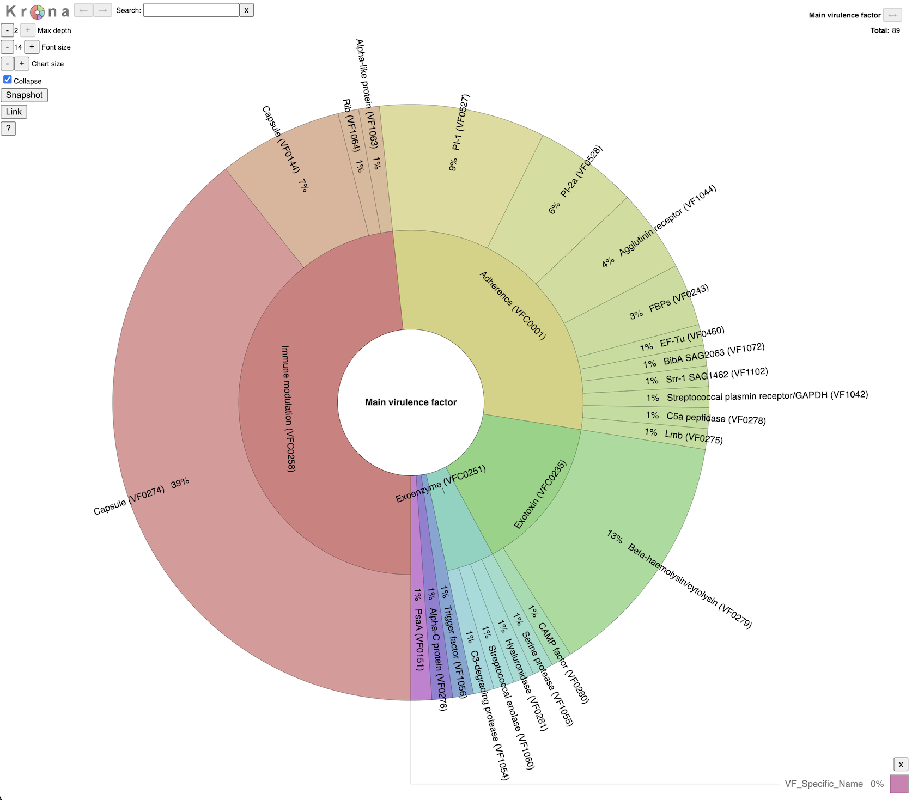

<p align="center">
  
</p>

# Virulence Factors Classifier

A comprehensive tool for identifying and classifying virulence factors in bacterial genomes using BLAST against the VFDB [Virulence Factor Database](https://www.mgc.ac.cn/VFs/main.htm), with automated visualization and interactive reporting.

Author: **Bruno Gomez-Gil** (<bruno@ciad.mx>).
CIAD AC, Mazatlán Unit for Aquaculture

## Abstract

This script performs comprehensive identification of virulence factors in bacterial genome fasta sequences by comparing them against the VFDB database using BLASTN. It automatically parses VFDB headers to extract gene symbols, virulence factor categories, and originating organisms, then provides detailed annotated results including gene symbols, specific virulence factor names, broad categories, and alignment statistics. The tool generates automated visualizations and interactive Krona charts for comprehensive analysis, designed for researchers studying bacterial pathogenicity and virulence gene content.

## Features

- **Automated VFDB Integration**: Automatically detects and parses VFDB database headers
- **Comprehensive Annotation**: Extracts gene symbols, virulence factor categories, and organism information
- **BLAST-based Identification**: Uses NCBI BLAST+ for accurate sequence similarity searches
- **Dual Output Format**: Generates both complete results and filtered best hits automatically
- **Enhanced BLAST Output**: Includes strand information and alignment coordinates
- **Automated Visualization**: Generates summary plots showing virulence factor distribution by category
- **Interactive Krona Charts**: Creates interactive HTML charts for hierarchical data exploration
- **Flexible Input Options**: Supports custom VFDB FASTA file locations
- **Compressed File Support**: Automatically handles compressed (.gz) FASTA files
- **Multi-threaded Processing**: Configurable thread count for faster BLAST searches
- **Database Validation**: Checks for database existence before running analysis
- **Advanced Comparative Heatmaps**: Generate high-quality, publication-ready heatmaps from multiple samples using R and ComplexHeatmap

## System Requirements

- **Git** (optional, for cloning/downloading the repository)
- **Mamba** (optional but highly recommended, for faster conda package installation)
- **NCBI BLAST+** (version 2.12.0 or later)
- **Python 3.7+**
  - Pandas
  - Biopython
  - Matplotlib (optional, for visualization)
  - Seaborn (optional, for visualization)
- **Krona Tools** (optional, for interactive charts) - Install from [Krona GitHub](https://github.com/marbl/Krona)
- **VFDB Database** - Download from [VFDB Official Site](https://www.mgc.ac.cn/VFs/)
- **R** (optional, for advanced heatmap generation)
  - ComplexHeatmap (installed automatically by the script)
  - RColorBrewer
  - dplyr
  - tidyr

### Note

- Krona is optional - the script will work without it, but won't generate interactive HTML charts
- If Krona is not installed, the script will gracefully skip HTML generation with a warning

### OS Compatibility

The script is cross-platform and supports Linux, macOS, and Windows:

- **Linux/macOS**: Best performance and easy installation (Native support for all tools).
- **Windows**: Fully supported via **Mamba/Conda** or **WSL2** (recommended). Some features like Krona may require extra configuration if installed manually on native Windows.

## Installation

A functioning installation is composed of three main steps:

1. Clone the repository (or download the zip file)
2. Install the dependencies (using mamba or conda)
3. Download the VFDB fasta file and create the BLAST database

### Quick Installation with mamba (Recommended)

```bash
# 1. Clone the repository
git clone <repository-url>
cd virulence_factors

   # Make scripts executable if you want to run them directly
chmod +x *.py *.R

# 2. Install mamba (if not already installed)
conda install -c conda-forge mamba

   # Create environment from provided environment.yml file
mamba env create -f environment.yml

   # Activate the environment
conda activate virulence-factors
```

That's it! The environment.yml file includes all necessary dependencies including BLAST, Krona, R, and Python packages.

**Need more options?** See [INSTALLATION.md](INSTALLATION.md) for alternative installation methods and detailed setup instructions.

## Database Setup

### Quick Setup (Recommended)

```bash
# 3. Download and create BLAST database automatically
python virulence_factors.v0.1.0.py --setup

# Optional: Use a pre-downloaded local file instead of downloading
python virulence_factors.v0.1.0.py --setup --input-fasta path/to/VFDB_setB_nt.fas.gz

# Optional: Skip automated curation and use original headers
python virulence_factors.v0.1.0.py --setup --no-curation
```

**Note**: As a safety measure, the script will not overwrite an existing `VF_database/` directory. If you wish to re-download or re-curate the database, you must use the `--force` flag.

**Important**: The VFDB data is freely available under the Creative Commons Attribution-NonCommercial (CC BY-NC) license version 4.0. For commercial use, contact the authors directly. Visit <https://www.mgc.ac.cn/VFs/> for more information.

### Automated Database Curation (Longest Name Strategy)

The script includes an automated curation step during database indexing to ensure data integrity and consistency.

#### Why curation is needed

Discrepancies can occur in the source VFDB descriptors due to truncated names or non-translated symbols (e.g., "Beta-haemolysin" vs "-haemolysin"). This can lead to redundant rows in the final analysis or heatmap.

#### The "Longest Name" Strategy

1. **VF ID Tracking**: The script extracts the internal VF ID (e.g., `VF0279`) from every header.
2. **Consensus Selection**: For each VF ID, it identifies all naming variations and automatically selects the **longest (most complete)** version found across the entire database.
3. **Normalization**: All hits in your results are mapped to these Gold Standard names.

#### Curation Log

A detailed record of every modification (Original vs Curated) is stored in:
`VF_database/curation_log.tsv`

Errors might be introduced into the database this way, so be aware. If you prefer not to curate the original file, use the `--no-curation` flag, but duplication of some genes might appear.

## Basic Usage

```bash
cd virulence_factors
chmod +x virulence_factors.v0.1.0.py # if not already executable

python virulence_factors.v0.1.0.py -i your_genome.fasta -db VF_database/VFDB_db
```

The script can handle both compressed and uncompressed FASTA files:

- .fna (decompressed)
- .fna.gz (compressed) - automatically decompressed
- .fasta (decompressed)
- .fasta.gz (compressed) - automatically decompressed

### Advanced Usage

```bash
# Process multiple genomes at once
python virulence_factors.v0.1.0.py -i Sample1.fna Sample2.fna.gz Sample3.fasta -t 8
```

### Parameters

| Flag | Long | Required | Description |
| :--- | :--- | :--- | :--- |
| `--setup` | | No | Download VFDB, curate it, and create BLAST database automatically |
| `--input-fasta` | | No | Use a local VFDB FASTA file for setup instead of downloading |
| `--no-curation` | | No | Skip automated curation and use original VFDB headers |
| `--force` | | No | Force database re-download OR overwrite existing sample results |
| `--merge` | [files] | No | Consolidate results recursively from VF_results/. |
| `--out-matrix` | | No | Custom output path (default: VF_results/multiple_samples_best_hits.csv) |
| `-i` | `--input` | Yes | Path to input genome FASTA file(s) (supports multiple) |
| `-db` | `--database` | No | Path to BLAST database prefix (default: VF_database/VFDB_db) |
| `-v` | `--vfdb_fasta` | No | Path to VFDB FASTA file (auto-detected if not specified) |
| `-t` | `--threads` | No | Number of threads for BLAST (default: 4) |

## Output

The script creates a `VF_results/` directory. For each input sample, a dedicated subfolder is created:

### 1. Sample-Specific Folders

`VF_results/[SampleName]/`
Contains all individual analysis files for that specific sample.

**Safety Note**: To prevent accidental data loss, the script will skip any sample that already has an existing folder in `VF_results/`. Use the `--force` flag to overwrite existing results.

### 2. Result Files (per sample)

Inside each sample folder:

`[input_basename]_all_hits.tsv`
Contains all BLAST matches with complete annotation information.

### 2. Best Hits File

`[input_basename]_best_hits.tsv`
Contains filtered results with only the best match per gene per contig (highest bitscore).

### 3. Summary Plot

`[input_basename]_summary.png`
A bar chart showing the distribution of virulence factors by broad category (requires matplotlib/seaborn).

### 4. Interactive Krona Chart

`[input_basename]_VF.html`
An interactive HTML chart for hierarchical exploration of virulence factors (requires Krona tools).

### Aggregated Data Output

`[input_basename]_data4plot.tsv`
Tab-separated file with headers containing aggregated virulence factor data for custom visualizations.

**Columns**: Count, VF_Broad_Category, VF_Specific_Name

### 6. Heatmap Matrix

`VF_results/multiple_samples_best_hits.csv` (optional)
Automatically created when processing multiple files, or by running with `--merge`. Consolidates identity percentages for all detected genes across all samples.

### 7. Comparative Heatmap Plot (PDF)

`vf_heatmap.pdf` (optional)
A high-quality PDF heatmap generated by the R script, showing clustered samples and genes grouped by broad and specific virulence categories.

### Output Columns (TSV files)

- **Query_Sequence**: ID of the query sequence from your genome
- **Query_Start**: Start position of the alignment in the query sequence
- **Query_End**: End position of the alignment in the query sequence
- **Strand**: Alignment strand (plus/minus)
- **VF_Broad_Category**: Broad category of virulence factor
- **VF_Specific_Name**: Specific virulence factor name
- **VF_Gene_Symbol**: Gene symbol of the virulence factor
- **Identity_Pct**: Percentage identity of the alignment
- **E_Value**: E-value of the alignment
- **VF_Origin_Organism**: Organism from which the virulence factor originates
- **VF_ID**: VFDB database identifier

### Detailed Aggregated Data

`[input_basename]_data4plot.tsv`
Aggregated data file with headers for custom analysis and plotting.

**Columns**:

- **Count**: Number of hits for each virulence factor
- **VF_Broad_Category**: Broad category of virulence factor
- **VF_Specific_Name**: Specific virulence factor name

**Note**:

- TSV files are saved with tab separation for better bioinformatics compatibility
- Visualization files are generated only if the required dependencies are available
- All files are saved in the `VF_results/` directory to keep your workspace organized
- The `_data4plot.tsv` file is preserved for custom analysis and contains headers

## Example Workflow

After downloading and making the database, you can test the script with the included *Streptococcus agalactiae* genomes:

### Example with one genome

```bash
python virulence_factors.v0.1.0.py -i examples/NC_004116.fasta.gz
```

### Example with multiple genomes

```bash
python virulence_factors.v0.1.0.py -i examples/*.fasta.gz

# Generate an advanced comparative heatmap
./plot_vf_heatmap.R
```

### Example Output

The script provides a clean, color-coded terminal experience:

```text
 Auto-detected VFDB FASTA: VF_database/VFDB_setB_nt.fas
 Running BLASTN (Genome: examples/NC_004116.fasta vs DB: VF_database/VFDB_db)...
 BLAST finished.
 Processing results...
    Saved All Hits:  VF_results/NC_004116_all_hits.tsv
    Saved Best Hits: VF_results/NC_004116_best_hits.tsv
 Generating summary plot: VF_results/NC_004116_summary.png...
 Generating Krona chart: VF_results/NC_004116_VF.html...
    Krona HTML saved: VF_results/NC_004116_VF.html
```

Here's an example of the summary plot generated by the script:


of the Krona chart:



and of the heatmap:


## Troubleshooting

### Common Issues

1. **BLAST command not found**: Ensure BLAST+ is installed and in your PATH
2. **Database not found**: Verify the database path and that makeblastdb was run successfully
3. **VFDB FASTA not found**: Keep VFDB_setB_nt.fas in the same directory as the database or use `-v` parameter
4. **No results found**: Check that your genome file contains nucleotide sequences and try adjusting the e-value threshold
5. **Plot not generated**: Install matplotlib and seaborn with `pip install matplotlib seaborn`
6. **Krona chart not generated**: Install Krona tools or ensure ktImportText is in your PATH
7. **Permission errors**: Ensure you have write permissions for creating the `VF_results/` directory
8. **Compressed file error**: Ensure the .gz file is not corrupted and the script has read permissions

### Possible error messages

- `Error: The provided FASTA file was not found`: Check the path specified with `-v`
- `Error: Could not find 'VFDB_setB_nt.fas'`: Place the file in the database directory or use `-v`
- `BLAST Error: Ensure the database path is correct`: Verify database files exist and are accessible
- `[WARNING] matplotlib/seaborn not installed`: Install with `pip install matplotlib seaborn`
- `[WARNING] 'ktImportText' not found`: Install Krona tools or add to PATH

## File Structure

```text
virulence_factors/
├── virulence_factors.v0.1.0.py         # Main script (now handles downloads)
├── plot_vf_heatmap.R                   # Advanced heatmap generation script (R)
├── assets/                             # Project assets (logos, etc.)
│   └── logo.png                        # Project logo
├── requirements.txt                    # Python dependencies for pip installation
├── environment.yml                     # Conda environment specification
├── README.md                          # This file
├── VF_results/                        # Output directory (created automatically)
│   ├── [genome]_all_hits.tsv         # All BLAST matches
│   ├── [genome]_best_hits.tsv        # Filtered best matches
│   ├── [genome]_summary.png          # Summary plot
│   ├── [genome]_VF.html              # Interactive Krona chart
│   └── [genome]_data4plot.tsv        # Data for custom plotting (with headers)
└── VF_database/                      # Recommended directory for database files
    ├── VFDB_setB_nt.fas              # VFDB nucleotide sequences
    ├── VFDB_db.nhr                   # BLAST database files
    ├── VFDB_db.nin
    ├── VFDB_db.nsq
    ├── VFDB_metadata.txt             # Database metadata and timestamps
    └── ...
```

## Citation

If you use this tool in your research, please cite:

1. **VFDB Database**: Liu B, Zheng D, Jin Q, et al. VFDB 2019: a pathogenic bacterium virulence factor database. Nucleic Acids Res. 2019;47(D1):D698-D704 [10.1093/nar/gki008](https://doi.org/10.1093/nar/gki008)

2. **BLAST**: Altschul SF, Gish W, Miller W, et al. Basic local alignment search tool. J Mol Biol. 1990;215(3):403-410 [10.1016/0022-2836(90)90021-x](https://doi.org/10.1016/0022-2836(90)90021-x)

3. **Complex Heatmaps**: Zuguang Gu, et al., Complex heatmaps reveal patterns and correlations in multidimensional genomic data, Bioinformatics, 2016. [10.1093/bioinformatics/btw637](https://doi.org/10.1093/bioinformatics/btw637)

## License

This project is licensed under the MIT License - see the parent directory's License.md file for details.

## Contributing

Contributions are welcome! Please feel free to submit issues and enhancement requests.
